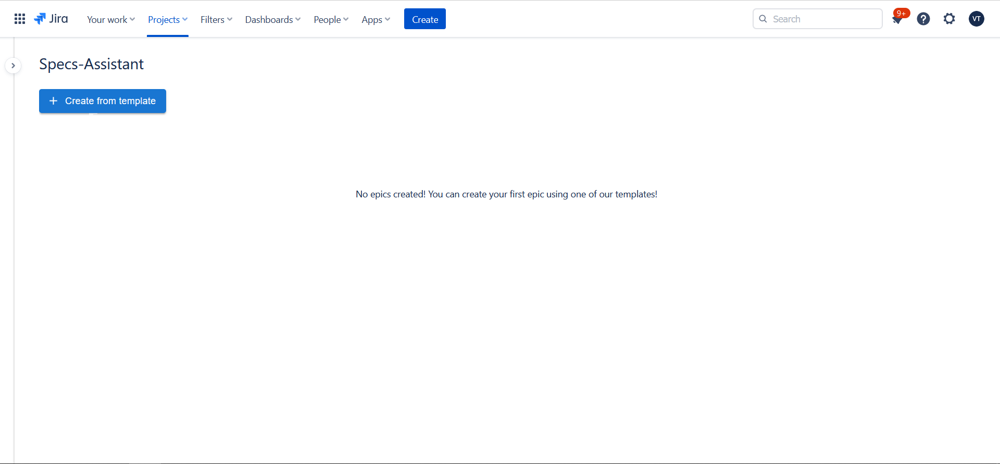
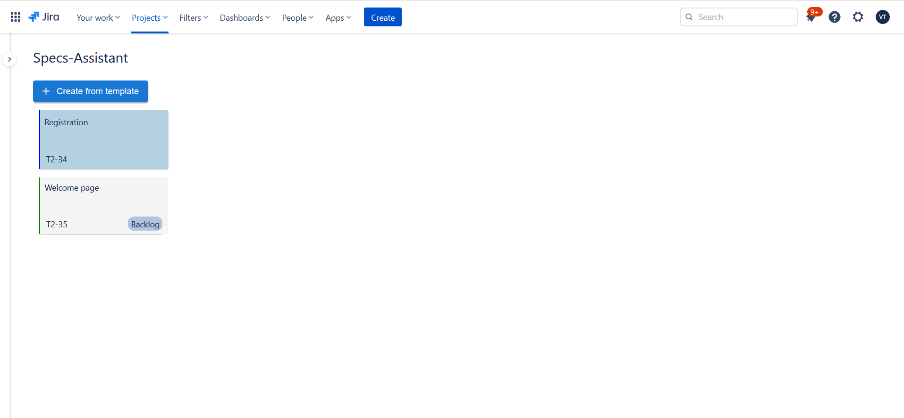
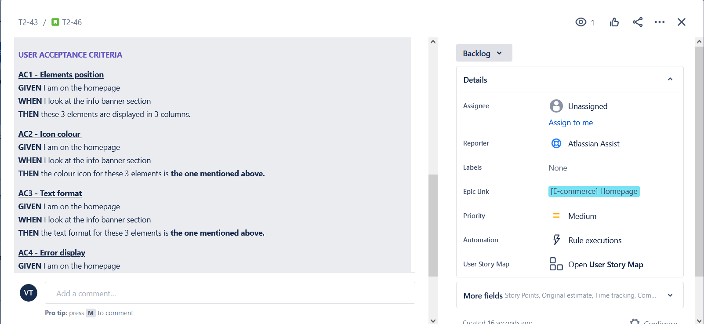

# Documentation
## What is Specs-Assistant

In large-scale projects there is a consistent need for Epics, Stories and Tasks that have a description which
emphaszies the user's needs and gives insight to the developer on how to implement said issue. These descriptions
are usually written by hand even tough in most cases the formula for certain well known issues, that appear in
most projects, is the same. Thus, writing these descriptions by hand becomes a long and tedious procces. Here is where
Specs-Assistant comes into the picture. Specs-Assistant is an eazy to use, fast and reliable tool that helps product owners and business analysts map
well known issues with templates that fill the description apropriately for each task.  

## How it works

After you chose the projects you would like to manage, you can open the app to manage issues.
Upon openning the application, you will be presented with the main dashboard
<!-- picture -->

From here you can click on 'Create from template' to add an epic and it's respective stories. Note that BA-assistant will work
as intended only if the epic issue type is called 'Epic' and the story issue type is called 'Story'. In future versions we will
allow name changing for issue types. After clicking on 'Create from template', a panel will open that will show all the available
templates. Choose what epics and issues you would like to add and click 'Create'.
<!-- picture -->

If your project is on the default settings then both epics and stories will be created automatically with the default 
templates.
<!-- picture -->

If you added custom fields to an epic or a story, then when pressing create, the usual issue modal will open and prompt you to manually
complete said fields.
 <!--picture  -->
 

 You can manage all of your epics and issues from the main dashboard.
 
 
 <!-- picture -->

## Summary

To sum it all up, Specs-Assistant is a simple and easy to use tool that can speed up the process of creating issues describing a feature in a way that will help the developer better understand the goal and functionalities of said feature, thereby speeding the entire development procces.
 

